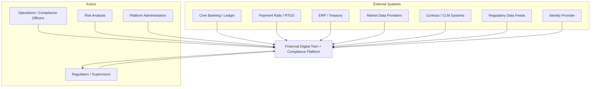
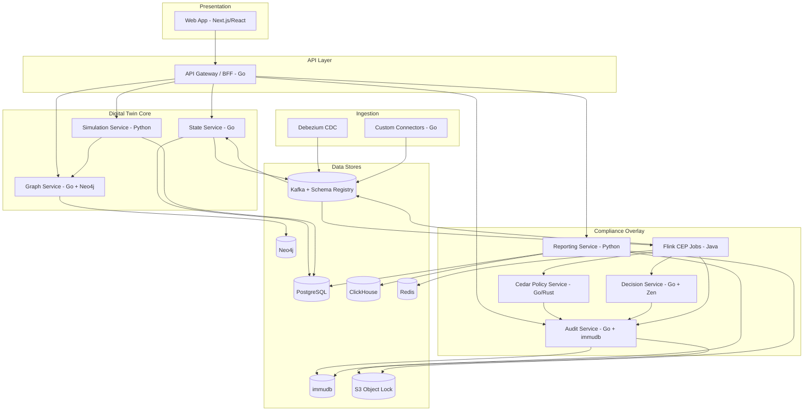
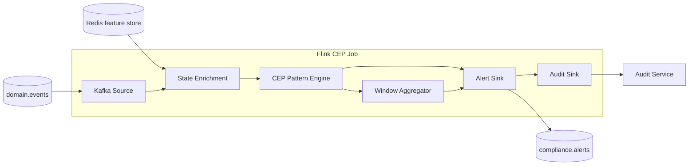
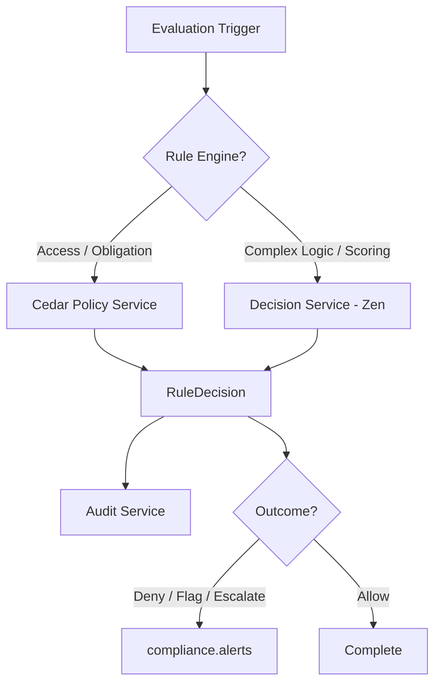
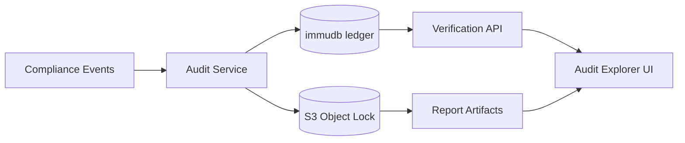

# Architecture

System architecture for the Financial Digital Twin + Compliance Platform. This document expands the high-level design with C4 context/container/component views and technology assignments per component.

See also: [domain-model.md](./domain-model.md), [data-flow.md](./data-flow.md), [adr/](./adr/).

---

## Implementation status

This document describes the **target** architecture across all phases. Components implemented in the repository today:

| Component | Phase | Status |
|-----------|-------|--------|
| Kafka, Schema Registry, Debezium CDC | 1 | Implemented |
| State Service, outbox, persona REST API | 1 | Implemented |
| Flink CEP (INT-M001, INT-M002, BASEL-M001) | 2 | Implemented |
| Redis online feature store | 2 | Implemented |
| Alert Service, WebSocket, alert console, Grafana | 2 | Implemented |
| Cedar Policy Service, GoRules Zen / Decision Service | 3 | Implemented — see [phase3-implementation-spec.md](./phase3-implementation-spec.md) |
| immudb audit ledger, Audit Explorer | 3 | Implemented — see [phase3-implementation-spec.md](./phase3-implementation-spec.md) |
| Neo4j / Graph Service, simulation | 4+ | Planned |
| Regulatory reporting (XBRL/SDMX) | 5+ | Planned |

Phase 2 is **implemented** on `main` (mechanical smoke + unit tests). Phase 3a (audit path) is **implemented** — [ADR-009](./adr/009-phase3-foundation-decisions.md), [phase3-implementation-spec.md](./phase3-implementation-spec.md).

---

## 1. Architectural Principles

1. **Intelligence layer, not replacement** — The twin ingests from source systems; it does not become the system of record for transactions or contracts.
2. **Event-first** — All state changes flow through a durable event log (Kafka) enabling replay, audit, and decoupling.
3. **Compliance embedded, not bolted on** — Monitoring, rules, audit, and reporting are first-class components, not afterthoughts.
4. **Polyglot best-of-breed** — Each component uses the language/runtime best suited to its concern (see [ADR-006](./adr/006-polyglot-language-strategy.md)).
5. **Policy-as-code** — Rules are version-controlled, tested in CI, and traceable to regulatory source.
6. **Explainability by design** — Every risk score and compliance decision includes rationale suitable for regulator review.
7. **Tamper-evident audit** — All compliance-relevant actions are recorded in a cryptographically verifiable ledger.

---

## 2. C4 Level 1 — System Context

### System Responsibilities

| Responsibility | Description |
|----------------|-------------|
| Ingest financial data | CDC and API connectors from operational systems |
| Maintain digital twins | Entity state, graph model, simulation |
| Monitor compliance | Real-time CEP, thresholds, velocity checks |
| Evaluate rules | Cedar policies + decision models |
| Record audit evidence | Immutable ledger + object storage |
| Generate reports | XBRL/SDMX regulatory submissions |
| Provide dashboards | Alerts, graph viz, scenario control, audit explorer |

---

## 3. C4 Level 2 — Container Diagram

---

## 4. Layer Architecture

### 4.1 Ingestion Layer

**Purpose**: Capture domain events from source systems with schema validation and idempotent delivery.

| Component | Technology | Responsibility |
|-----------|------------|----------------|
| Debezium Connect | Java (Kafka Connect) | CDC from PostgreSQL, Oracle, SQL Server source DBs |
| Custom API Connectors | Go | Poll/pull from REST APIs (market data, regulatory feeds) |
| File Connectors | Go | Batch ingest of XBRL, CSV regulatory files |
| Schema Registry | Confluent / Apicurio | Avro/Protobuf schema enforcement, compatibility checks |
| Event Envelope | Avro | Standard wrapper: `eventId`, `eventType`, `source`, `timestamp`, `payload`, `correlationId` |

**Design notes**:
- All events land on Kafka topics partitioned by entity ID for ordering guarantees.
- Dead-letter topics (`*.dlq`) for poison messages with alerting.
- Idempotency keys on all producer events to support exactly-once downstream processing.

### 4.2 Event Backbone

**Purpose**: Durable, replayable, ordered event log connecting all components.

| Component | Technology | Responsibility |
|-----------|------------|----------------|
| Apache Kafka | KRaft mode | Primary event bus; 7–10 year retention on compliance topics |
| Schema Registry | Confluent | Schema versioning and compatibility |
| Kafka Connect | Debezium, custom sinks | Bridge to PostgreSQL, ClickHouse, immudb |

See [ADR-001](./adr/001-kafka-flink-streaming.md).

### 4.3 Digital Twin Core

**Purpose**: Maintain living representations of financial entities, their interconnections, and simulation capabilities.

#### State Service (Go)

- Consumes domain events from Kafka.
- Upserts `TwinPersona`, `Account`, `Instrument`, `PaymentFlow` in PostgreSQL.
- Publishes `EntityStateUpdated` events for downstream consumers.
- Exposes REST/gRPC API for state queries.

#### Graph Service (Go + Neo4j)

- Builds and maintains exposure graph from `ExposureRecorded` events.
- Supports Cypher queries: shortest path, centrality, layer-aware aggregation.
- Publishes graph snapshot events for simulation service.

#### Simulation Service (Python)

- Agent-based and deterministic stress testing.
- Consumes graph snapshots + persona state.
- Libraries: NetworkX, pandas, PyTorch (optional ML), Ray (optional distributed).
- Outputs: risk scores, stress test results, scenario comparisons.
- Publishes `SimulationCompleted` events with explainable rationale.

### 4.4 Compliance Overlay

**Purpose**: Continuous compliance evaluation across four functions: monitoring, rules, audit, reporting.

#### Real-Time Monitoring (Apache Flink — Java)

- Stateful stream processing with exactly-once semantics.
- CEP patterns: velocity limits, threshold breaches, settlement queue depth, SLA violations.
- Windowed aggregations: rolling 24h transaction sums, intraday liquidity ratios.
- Outputs: `ComplianceAlert` events to Kafka + Audit Service.
- State backend: RocksDB with incremental checkpointing to S3.

See [ADR-001](./adr/001-kafka-flink-streaming.md).

#### Policy Service (Cedar — Go/Rust SDK)

- In-process Cedar policy evaluation.
- Principal-action-resource model for access control and obligation checks.
- Formal verification via Cedar Analyzer in CI.
- Sub-millisecond evaluation for hot paths.

See [ADR-002](./adr/002-cedar-decision-engine.md).

#### Decision Service (GoRules Zen — Go)

- Complex regulatory logic and risk scoring via JSON Decision Models.
- Versioned decision tables, rule chains, and scorecards.
- Business-user-friendly rule authoring with developer review in CI.
- Called by Flink jobs and Simulation Service.

See [ADR-002](./adr/002-cedar-decision-engine.md).

#### Audit Service (Go + immudb)

- Append-only, cryptographically verifiable ledger.
- Records: state changes, rule decisions, alerts, report generation, access events.
- Hash chain with client-side verification.
- Evidence artifacts (reports, snapshots) stored in S3 Object Lock (Compliance mode).

See [ADR-003](./adr/003-immudb-audit-ledger.md).

#### Reporting Service (Python)

- Reads twin state, audit ledger, and time-series metrics.
- Maps to regulatory taxonomies (FINREP, COREP, AnaCredit, EMIR, DORA).
- Generates XBRL/SDMX artifacts.
- Validates against taxonomy schemas before archiving.
- Scheduled (cron) and on-demand generation.

### 4.5 API Layer

**Purpose**: Unified query and command interface for UI and external integrations.

| Component | Technology | Responsibility |
|-----------|------------|----------------|
| API Gateway / BFF | Go | REST/GraphQL aggregation, auth middleware, rate limiting |
| WebSocket Hub | Go | Real-time alert streaming to UI |
| Auth Middleware | Cedar + OIDC | JWT validation, ABAC enforcement |

### 4.6 Presentation Layer

**Purpose**: Operator dashboards, alert management, simulation control, audit exploration.

| Component | Technology | Responsibility |
|-----------|------------|----------------|
| Web App | Next.js + React + TypeScript | SPA with SSR for dashboards |
| Graph Visualization | sigma.js / react-flow | Exposure graph, contagion paths |
| Alert Console | React components | Live alert feed, acknowledge/escalate |
| Simulation Control | React forms | Scenario parameters, run/compare |
| Audit Explorer | React + immudb client | Ledger search, hash verification |
| Report Viewer | React + XBRL viewer | Draft review, submission tracking |

---

## 5. C4 Level 3 — Component Diagrams

### 5.1 Compliance Monitoring (Flink)

**CEP Patterns (examples)**:

| Pattern ID | Description | Regime |
|------------|-------------|--------|
| `VEL-001` | >N transactions same account in 1h exceeding threshold | AML / Internal |
| `LIQ-001` | Intraday liquidity ratio below LCR minimum | Basel / COREP |
| `SET-001` | RTGS queue depth > threshold for >5 min | Payment oversight |
| `ICT-001` | ICT provider SLA uptime below contract minimum | DORA |
| `EXP-001` | Counterparty exposure exceeds approved limit | Internal / EMIR |

### 5.2 Policy & Decision Evaluation

### 5.3 Audit & Evidence Pipeline

---

## 6. Data Store Assignments

See [ADR-004](./adr/004-datastore-selection.md) for full rationale.

| Store | Technology | Data | Retention |
|-------|------------|------|-----------|
| Entity state | PostgreSQL | Personas, accounts, instruments, contracts, rules metadata | Indefinite (soft delete) |
| Event log | Kafka | All domain and compliance events | 7–10 years (compliance topics) |
| Graph | Neo4j | Exposures, interconnections, contagion paths | Rolling snapshots + current |
| Time-series | ClickHouse | Metrics, monitoring history, aggregation inputs | 3 years hot, archive to S3 |
| Audit ledger | immudb | Decisions, alerts, state changes, access events | Regulatory minimum + 1 year |
| Cache / features | Redis | Online features, session state, rate counters | TTL-based |
| Artifacts | S3 Object Lock | Reports, evidence snapshots, Flink savepoints | 7–10 years (Compliance mode) |

---

## 7. Cross-Cutting Concerns

### 7.1 Security

| Concern | Implementation |
|---------|----------------|
| Authentication | OIDC (Auth0, Keycloak, or cloud IdP) |
| Authorization | Cedar ABAC/RBAC policies |
| Encryption at rest | AES-256 (DB, S3, Kafka) |
| Encryption in transit | TLS 1.3 everywhere |
| Secrets | HashiCorp Vault or cloud secrets manager |
| Network | Private subnets, mTLS between services |

### 7.2 Observability

| Signal | Tool | Key Metrics |
|--------|------|-------------|
| Traces | OpenTelemetry → Jaeger/Tempo | End-to-end evaluation latency |
| Metrics | Prometheus + Grafana | Kafka lag, Flink checkpoint duration, API p99 |
| Logs | Structured JSON → Loki/ELK | Correlation ID on all log lines |
| Alerts | Grafana Alerting / PagerDuty | Consumer lag > threshold, checkpoint failures |

### 7.3 Deployment

| Concern | Implementation |
|---------|----------------|
| Orchestration | Kubernetes (EKS, GKE, or self-hosted) |
| IaC | Terraform modules per environment |
| CI/CD | GitHub Actions / GitLab CI with policy test gates |
| Environments | dev → staging → prod with schema compatibility checks |
| Flink ops | Flink Kubernetes Operator |

### 7.4 Schema Governance

- All Kafka topics have registered Avro/Protobuf schemas.
- Backward-compatible schema evolution enforced by Schema Registry.
- Breaking changes require new topic version (`domain.events.v2`).
- Domain events defined in shared schema repository.

---

## 8. Non-Functional Requirements

| Requirement | Target | Component |
|-------------|--------|-----------|
| Monitoring latency | < 2s p99 from event to alert | Flink CEP |
| Policy evaluation | < 5ms p99 in-process | Cedar / Zen |
| API query latency | < 200ms p99 for state reads | State Service + Redis cache |
| Audit write durability | Zero data loss (fsync + replication) | immudb |
| Event throughput | 10K events/sec sustained (initial) | Kafka |
| Availability | 99.9% for monitoring + API | K8s HA, multi-AZ |
| Report generation | < 30 min for monthly FINREP pack | Reporting Service |
| Data retention | 7–10 years compliance events | Kafka + S3 + immudb |

---

## 9. Integration Patterns

| Pattern | Use Case | Implementation |
|---------|----------|----------------|
| Event Carried State Transfer | Twin state updates | Domain events carry full entity snapshot |
| Event Sourcing (partial) | Audit trail | immudb stores all compliance events; PostgreSQL stores current state |
| CQRS | Read-heavy dashboards | ClickHouse for analytics reads; PostgreSQL for transactional writes |
| Saga | Multi-step report submission | Kafka choreography with compensating events |
| Outbox | Reliable event publishing | PostgreSQL outbox table → Debezium → Kafka |

---

## 10. Failure Modes and Mitigations

| Failure | Impact | Mitigation |
|---------|--------|------------|
| Kafka broker loss | Ingestion pause | Multi-broker replication, KRaft quorum |
| Flink checkpoint failure | Monitoring gap | Alert on checkpoint duration; auto-restart from savepoint |
| Source system unavailable | Stale twin state | `lastSyncedAt` staleness alerts; degrade gracefully |
| immudb unavailable | Audit gap (critical) | Buffer to Kafka audit topic; replay on recovery |
| Schema incompatibility | Consumer crash | Schema Registry compatibility mode = BACKWARD |
| Decision engine timeout | Missed evaluation | Circuit breaker; default to `Escalate` outcome |

---

## 11. Related Documents

- [domain-model.md](./domain-model.md) — Entities, personas, glossary
- [data-flow.md](./data-flow.md) — Topics, schemas, end-to-end flows
- [compliance-mapping.md](./compliance-mapping.md) — Regime → rule → check → report
- [roadmap.md](./roadmap.md) — Phased implementation plan
- [adr/](./adr/) — Architecture decision records
