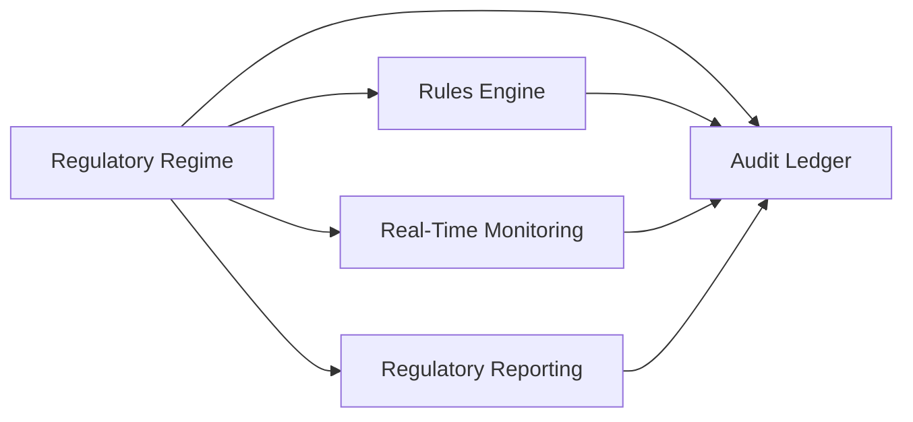
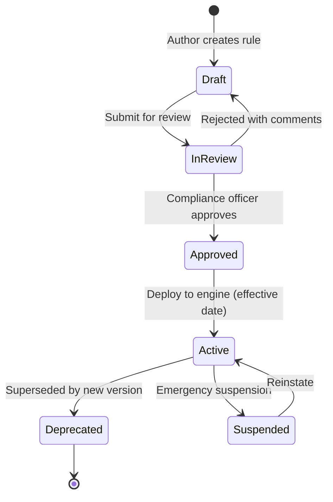

# Compliance Mapping

Maps target regulatory regimes to platform rules, real-time monitoring checks, audit requirements, and regulatory reports.

See also: [domain-model.md](./domain-model.md), [architecture.md](./architecture.md), [data-flow.md](./data-flow.md).

---

## Overview

Each regime is decomposed into four platform capabilities:

| Capability | Platform Component | Output |
|------------|-------------------|--------|
| **Rules** | Cedar policies + Zen decision models | `RuleDecision` |
| **Monitoring** | Flink CEP patterns | `ComplianceAlert` |
| **Audit** | immudb ledger + S3 artifacts | `AuditEntry` |
| **Reporting** | Reporting Service | `RegulatoryReport` (XBRL/SDMX) |

---

## Regime Summary

| Regime | Scope | Reporting Frequency | Primary Personas |
|--------|-------|---------------------|------------------|
| **FINREP** | Financial reporting (balance sheet, P&L) | Quarterly / annual | Institution, Instrument |
| **COREP** | Capital adequacy (own funds, RWAs) | Quarterly | Institution |
| **AnaCredit** | Credit data (loan-level granularity) | Monthly | Instrument, Counterparty |
| **EMIR** | Derivatives reporting and clearing | Daily / T+1 | Instrument, Counterparty |
| **DORA** | Digital operational resilience (ICT) | Annual register + incident | Contract, ICTService |
| **Basel III/IV** | Liquidity and capital standards | Continuous + quarterly | Institution, PaymentFlow |
| **Internal** | Firm-specific limits and policies | Continuous | All personas |

---

## FINREP (Financial Reporting)

**Regulator**: EBA / national competent authorities  
**Framework**: EBA ITS on supervisory reporting (Implementing Regulation (EU) 680/2014)

### Rules (Cedar + Zen)

| Rule ID | Engine | Description | Severity |
|---------|--------|-------------|----------|
| `FINREP-R001` | Cedar | Only authorized users with `role=Reporter` can generate FINREP submissions | Blocking |
| `FINREP-R002` | Zen | Balance sheet assets must equal liabilities + equity (± tolerance) | Critical |
| `FINREP-R003` | Zen | All instruments must map to valid EBA taxonomy code before report generation | Blocking |
| `FINREP-R004` | Zen | Intercompany eliminations must net to zero within consolidation scope | Critical |
| `FINREP-R005` | Cedar | Report submission requires four-eyes approval (`approver` ≠ `preparer`) | Blocking |

### Monitoring (Flink CEP)

| Check ID | Pattern | Threshold | Alert Severity |
|----------|---------|-----------|----------------|
| `FINREP-M001` | Balance sheet reconciliation drift | Assets − (Liabilities + Equity) > €10K | Warning |
| `FINREP-M002` | Unmapped instrument count | > 0 instruments without taxonomy code | Critical |
| `FINREP-M003` | Reporting deadline proximity | < 5 business days to submission deadline | Warning |
| `FINREP-M004` | Consolidation scope change | Entity added/removed from scope without approval | Critical |

### Audit Requirements

- Every report generation: `ReportGenerated` entry with taxonomy version, data snapshot hash
- Every validation failure: `RuleDecision` with `outcome=Deny` and field-level rationale
- Every submission: `ReportGenerated` with submission receipt reference

### Reports

| Report Code | Description | Format | Schedule |
|-------------|-------------|--------|----------|
| `FINREP_F01` | Balance sheet | XBRL (EBA taxonomy) | Quarterly |
| `FINREP_F02` | Income statement | XBRL | Quarterly |
| `FINREP_F03` | Statement of changes in equity | XBRL | Quarterly |
| `FINREP_F04` | Statement of cash flows | XBRL | Quarterly |
| `FINREP_F40` | Asset encumbrance | XBRL | Semi-annual |

---

## COREP (Common Reporting — Capital)

**Regulator**: EBA / national competent authorities  
**Framework**: CRR/CRD IV, EBA ITS on COREP

### Rules (Cedar + Zen)

| Rule ID | Engine | Description | Severity |
|---------|--------|-------------|----------|
| `COREP-R001` | Zen | CET1 ratio must be ≥ regulatory minimum (4.5% + buffers) | Critical |
| `COREP-R002` | Zen | Total capital ratio must be ≥ 8% | Critical |
| `COREP-R003` | Zen | Leverage ratio must be ≥ 3% | Critical |
| `COREP-R004` | Zen | RWA calculation must use approved IRB/SA methodology | Blocking |
| `COREP-R005` | Cedar | Capital adjustment entries require `role=CapitalManager` authorization | Blocking |

### Monitoring (Flink CEP)

| Check ID | Pattern | Threshold | Alert Severity |
|----------|---------|-----------|----------------|
| `COREP-M001` | CET1 ratio below buffer | CET1 < 7.0% (minimum + capital conservation buffer) | Critical |
| `COREP-M002` | Intraday capital drift | CET1 change > 50bps in 1 hour | Warning |
| `COREP-M003` | RWA concentration | Single counterparty RWA > 25% of total | Warning |
| `COREP-M004` | Leverage ratio breach | Leverage ratio < 3.0% | Critical |

### Audit Requirements

- Every capital ratio calculation: inputs, methodology version, result
- Every breach alert: timestamp, ratio value, threshold, affected entity
- Stress test results linked to COREP report submissions

### Reports

| Report Code | Description | Format | Schedule |
|-------------|-------------|--------|----------|
| `COREP_C01` | Own funds | XBRL | Quarterly |
| `COREP_C02` | Own funds requirements | XBRL | Quarterly |
| `COREP_C03` | Credit and counterparty credit risk (SA) | XBRL | Quarterly |
| `COREP_C07` | Leverage ratio | XBRL | Quarterly |
| `COREP_C08` | Market risk | XBRL | Quarterly |

---

## AnaCredit (Analytical Credit Datasets)

**Regulator**: ECB / national central banks  
**Framework**: Regulation (EU) 2016/867

### Rules (Cedar + Zen)

| Rule ID | Engine | Description | Severity |
|---------|--------|-------------|----------|
| `ANAC-R001` | Zen | Every loan ≥ €25K must have debtor LEI or NACE code | Blocking |
| `ANAC-R002` | Zen | Credit amount must match sum of instrument notional values | Critical |
| `ANAC-R003` | Zen | Protection value must not exceed collateral market value | Warning |
| `ANAC-R004` | Cedar | Loan-level data access restricted to `role=CreditAnalyst` or `role=Reporter` | Blocking |
| `ANAC-R005` | Zen | Missing mandatory AnaCredit fields block report generation | Blocking |

### Monitoring (Flink CEP)

| Check ID | Pattern | Threshold | Alert Severity |
|----------|---------|-----------|----------------|
| `ANAC-M001` | New loan without LEI/NACE | Loan created > 24h ago, no identifier | Critical |
| `ANAC-M002` | Credit amount drift | Credit amount change > 10% without event | Warning |
| `ANAC-M003` | Reporting completeness | < 100% mandatory fields populated at T-3 days | Critical |
| `ANAC-M004` | Counterparty concentration | Top 10 debtors > 50% of total credit volume | Info |

### Audit Requirements

- Every loan-level data change: field-level diff with source system reference
- Every identifier validation: LEI/NACE lookup result and timestamp
- Report submission with record count and completeness score

### Reports

| Report Code | Description | Format | Schedule |
|-------------|-------------|--------|----------|
| `ANAC_Table1` | Counterparty reference data | SDMX | Monthly |
| `ANAC_Table2` | Instrument data | SDMX | Monthly |
| `ANAC_Table3` | Financial data | SDMX | Monthly |
| `ANAC_Table4` | Protection received data | SDMX | Monthly |

---

## EMIR (European Market Infrastructure Regulation)

**Regulator**: ESMA / national competent authorities  
**Framework**: Regulation (EU) 648/2012 (as amended)

### Rules (Cedar + Zen)

| Rule ID | Engine | Description | Severity |
|---------|--------|-------------|----------|
| `EMIR-R001` | Zen | OTC derivative above clearing threshold must be cleared via CCP | Critical |
| `EMIR-R002` | Zen | All reportable derivatives must have UTI (Unique Trade Identifier) | Blocking |
| `EMIR-R003` | Zen | Collateral posted must meet EMIR margin requirements | Critical |
| `EMIR-R004` | Cedar | Trade reporting access restricted to `role=TradeReporter` | Blocking |
| `EMIR-R005` | Zen | Counterparty above clearing threshold must be registered | Critical |

### Monitoring (Flink CEP)

| Check ID | Pattern | Threshold | Alert Severity |
|----------|---------|-----------|----------------|
| `EMIR-M001` | Uncleared OTC above threshold | Notional > clearing threshold, status ≠ Cleared | Critical |
| `EMIR-M002` | Missing UTI | Derivative trade > 1h old without UTI | Critical |
| `EMIR-M003` | Collateral shortfall | Posted collateral < required margin + buffer | Critical |
| `EMIR-M004` | Reporting timeliness | Trade not reported within T+1 deadline | Critical |
| `EMIR-M005` | Counterparty exposure limit | EMIR exposure > approved limit | Warning |

### Audit Requirements

- Every trade report submission: UTI, trade details hash, submission timestamp
- Every clearing decision: threshold calculation inputs and result
- Every collateral valuation: methodology, market data source, timestamp

### Reports

| Report Code | Description | Format | Schedule |
|-------------|-------------|--------|----------|
| `EMIR_TR` | Trade report | XML (ESMA schema) | T+1 daily |
| `EMIR_CR` | Collateral report | XML | Daily |
| `EMIR_OR` | Outstanding report | XML | Daily |

---

## DORA (Digital Operational Resilience Act)

**Regulator**: National competent authorities / ESAs  
**Framework**: Regulation (EU) 2022/2554

### Rules (Cedar + Zen)

| Rule ID | Engine | Description | Severity |
|---------|--------|-------------|----------|
| `DORA-R001` | Cedar | Critical ICT contracts require `role=ICTRiskManager` approval | Blocking |
| `DORA-R002` | Zen | Critical ICT provider must have exit strategy documented | Critical |
| `DORA-R003` | Zen | ICT contract SLA uptime must meet DORA minimum (99.x%) | Critical |
| `DORA-R004` | Zen | ICT provider must be registered in DORA register (LEI required) | Blocking |
| `DORA-R005` | Cedar | ICT incident classification requires `role=IncidentManager` | Blocking |
| `DORA-R006` | Zen | Subcontracting chain depth ≤ 3 for critical ICT services | Warning |

### Monitoring (Flink CEP)

| Check ID | Pattern | Threshold | Alert Severity |
|----------|---------|-----------|----------------|
| `DORA-M001` | ICT SLA breach | Uptime < contract SLA for current month | Critical |
| `DORA-M002` | Unregistered ICT provider | Critical service with unregistered provider | Critical |
| `DORA-M003` | Contract expiry proximity | Critical contract expiring < 90 days without renewal | Warning |
| `DORA-M004` | Incident response SLA | Major incident not classified within 4 hours | Critical |
| `DORA-M005` | Exit strategy gap | Critical ICT provider without exit plan | Critical |
| `DORA-M006` | Subcontracting depth | Subcontracting chain > 3 levels for critical service | Warning |

### Audit Requirements

- Every ICT contract change: obligation diff, criticality tier, approval chain
- Every SLA measurement: provider, metric, value, measurement period
- Every incident: classification, timeline, impact assessment, notification status
- Annual ICT register snapshot with hash verification

### Reports

| Report Code | Description | Format | Schedule |
|-------------|-------------|--------|----------|
| `DORA_ICT_REG` | ICT third-party register | XML (EBA/ESMA template) | Annual |
| `DORA_INCIDENT` | Major ICT incident report | XML | Within 4h / 72h / 1 month |
| `DORA_TESTING` | Digital resilience testing results | XML | Annual |

---

## Basel III/IV (Liquidity and Capital Standards)

**Regulator**: BCBS / national competent authorities  
**Framework**: Basel III (CRR/CRD transposition)

### Rules (Cedar + Zen)

| Rule ID | Engine | Description | Severity |
|---------|--------|-------------|----------|
| `BASEL-R001` | Zen | LCR (Liquidity Coverage Ratio) must be ≥ 100% | Critical |
| `BASEL-R002` | Zen | NSFR (Net Stable Funding Ratio) must be ≥ 100% | Critical |
| `BASEL-R003` | Zen | Large exposure to single counterparty ≤ 25% of Tier 1 capital | Critical |
| `BASEL-R004` | Zen | Intraday liquidity buffer must cover projected outflows | Warning |

### Monitoring (Flink CEP)

| Check ID | Pattern | Threshold | Alert Severity |
|----------|---------|-----------|----------------|
| `BASEL-M001` | LCR below 100% | LCR < 100% | Critical |
| `BASEL-M002` | Intraday liquidity shortfall | Projected outflows > available buffer in next 2h | Critical |
| `BASEL-M003` | Large exposure breach | Single counterparty exposure > 25% Tier 1 | Critical |
| `BASEL-M004` | RTGS queue buildup | Settlement queue depth > threshold for > 5 min | Warning |
| `BASEL-M005` | Liquidity hoarding pattern | Institution reducing interbank lending > 30% in 24h | Info |

### Audit Requirements

- Every LCR/NSFR calculation: HQLA breakdown, outflow assumptions, result
- Every large exposure alert: counterparty, exposure amount, limit, Tier 1 capital
- Stress test scenarios and results linked to liquidity reports

### Reports

| Report Code | Description | Format | Schedule |
|-------------|-------------|--------|----------|
| `BASEL_LCR` | Liquidity Coverage Ratio | XBRL / internal | Daily |
| `BASEL_NSFR` | Net Stable Funding Ratio | XBRL / internal | Quarterly |
| `BASEL_LE` | Large exposures | XBRL | Quarterly |

---

## Internal Policies

Firm-specific limits and operational policies not tied to a specific regulatory regime.

### Rules (Cedar + Zen)

| Rule ID | Engine | Description | Severity |
|---------|--------|-------------|----------|
| `INT-R001` | Zen | Transaction velocity: > N transactions per account per hour | Warning |
| `INT-R002` | Zen | Counterparty exposure must not exceed approved limit | Critical |
| `INT-R003` | Cedar | Sensitive data access requires MFA + role authorization | Blocking |
| `INT-R004` | Zen | Payment amount > dual authorization threshold requires approver | Blocking |
| `INT-R005` | Zen | Sanctions screening must pass before payment release | Blocking |

### Monitoring (Flink CEP)

| Check ID | Pattern | Threshold | Alert Severity |
|----------|---------|-----------|----------------|
| `INT-M001` | Transaction velocity | > 50 transactions/account/hour | Warning |
| `INT-M002` | Sanctions hit | Counterparty on sanctions list | Blocking |
| `INT-M003` | Dual auth bypass | Payment > €100K without approver | Critical |
| `INT-M004` | Off-hours access | Sensitive data access outside business hours | Warning |
| `INT-M005` | Geographic anomaly | Transaction origin country ≠ account country | Warning |

---

## Cross-Regime Compliance Matrix

| Capability | FINREP | COREP | AnaCredit | EMIR | DORA | Basel | Internal |
|------------|--------|-------|-----------|------|------|-------|----------|
| Cedar policies | ✓ | ✓ | ✓ | ✓ | ✓ | ✓ | ✓ |
| Zen decision models | ✓ | ✓ | ✓ | ✓ | ✓ | ✓ | ✓ |
| Flink CEP monitoring | ✓ | ✓ | ✓ | ✓ | ✓ | ✓ | ✓ |
| immudb audit | ✓ | ✓ | ✓ | ✓ | ✓ | ✓ | ✓ |
| XBRL reporting | ✓ | ✓ | — | — | — | ✓ | — |
| SDMX reporting | — | — | ✓ | — | — | — | — |
| XML reporting | — | — | — | ✓ | ✓ | — | — |
| Graph analytics | ✓ | ✓ | ✓ | ✓ | ✓ | ✓ | ✓ |
| Simulation / stress | ✓ | ✓ | — | — | — | ✓ | — |

---

## Rule Lifecycle

### CI Pipeline Gates

1. **Schema validation** — Rule conforms to Cedar/JDM schema
2. **Unit tests** — Fixture inputs produce expected outputs
3. **Cedar Analyzer** — Formal verification (Tier 1 only)
4. **Regression suite** — Full rule set re-evaluated against historical data
5. **Approval gate** — Compliance officer sign-off required for `Critical` and `Blocking` rules

---

## Semantic Mapping Layer

The reporting service uses a **taxonomy mapping layer** to translate twin entity attributes to regulatory codes:

| Twin Attribute | FINREP | COREP | AnaCredit | EMIR | DORA |
|----------------|--------|-------|-----------|------|------|
| `instrumentType=Loan` | F0610 | C07 SA | Table 2 | — | — |
| `instrumentType=Derivative` | F0610 | C08 | — | TR | — |
| `entityType=ICTProvider` | — | — | — | — | ICT_REG |
| `contractType=ICTOutsourcing` | — | — | — | — | ICT_REG |
| `accountType=Nostro` | F0010 | — | — | — | — |

Mapping tables are versioned and stored in PostgreSQL with effective date ranges. Changes require compliance review.

---

## Open Items

1. **Jurisdiction-specific variants** — National discretions may require country-specific rule variants (e.g., UK EMIR post-Brexit)
2. **Taxonomy version management** — EBA taxonomy updates (annual) require mapping layer migration
3. **Consolidation scope rules** — Group vs solo reporting may require duplicate rule sets
4. **Cross-regime deduplication** — Same underlying check (e.g., counterparty exposure) may appear in COREP, EMIR, and Internal — need shared rule references

Tracked in [roadmap.md](./roadmap.md).
