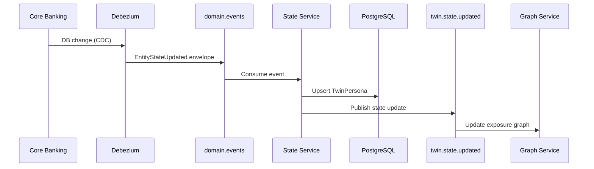
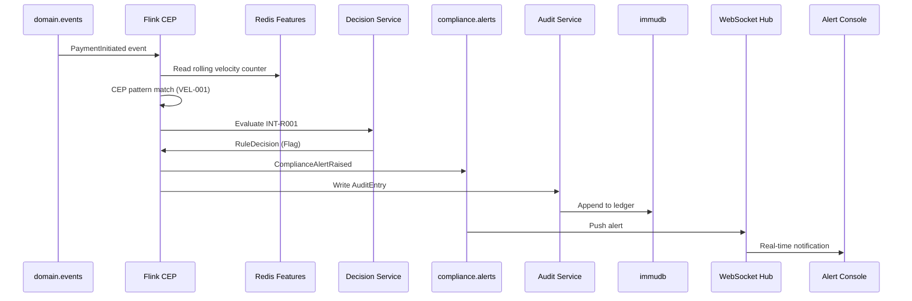
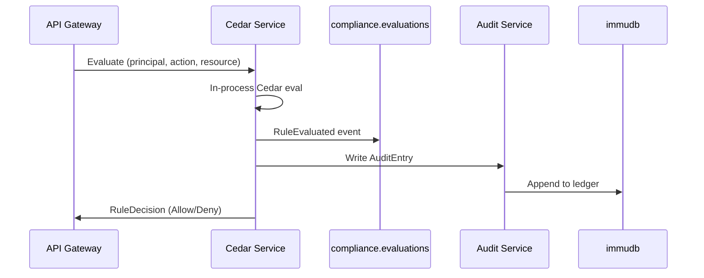
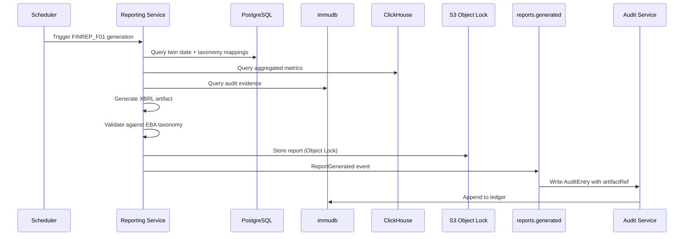
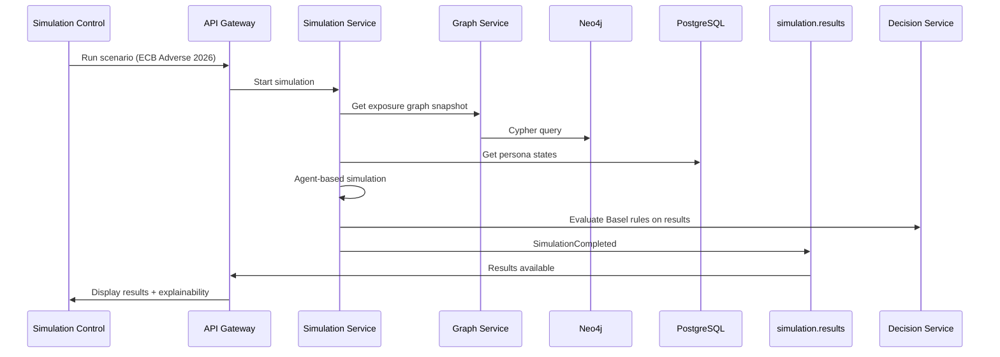
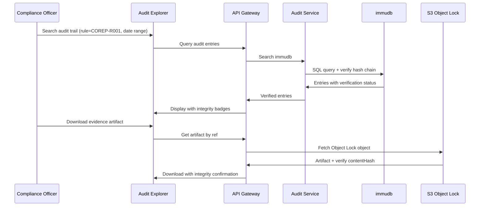

# Data Flow

Kafka topics, event/schema contracts, audit ledger record format, and end-to-end data flows for the Financial Digital Twin + Compliance Platform.

See also: [architecture.md](./architecture.md), [domain-model.md](./domain-model.md), [compliance-mapping.md](./compliance-mapping.md).

---

## 1. Event Envelope

All Kafka events use a standard envelope schema (Avro):

```json
{
  "eventId": "550e8400-e29b-41d4-a716-446655440000",
  "eventType": "EntityStateUpdated",
  "eventVersion": "1.0",
  "source": "state-service",
  "correlationId": "req-abc-123",
  "causationId": "550e8400-e29b-41d4-a716-446655440001",
  "timestamp": "2026-06-13T18:45:00.000Z",
  "idempotencyKey": "entity-123-v42",
  "payload": { }
}
```

| Field | Type | Required | Description |
|-------|------|----------|-------------|
| `eventId` | UUID | Yes | Unique event identifier |
| `eventType` | string | Yes | Domain event type (see Event Types) |
| `eventVersion` | semver | Yes | Schema version |
| `source` | string | Yes | Producing service name |
| `correlationId` | string | Yes | End-to-end trace ID |
| `causationId` | UUID? | No | Preceding event that caused this one |
| `timestamp` | ISO 8601 | Yes | Event creation time (UTC) |
| `idempotencyKey` | string | Yes | Deduplication key |
| `payload` | object | Yes | Event-specific data |

---

## 2. Kafka Topics

### 2.1 Topic Registry

| Topic | Partitions | Retention | Producers | Consumers |
|-------|------------|-----------|-----------|-----------|
| `domain.events` | 24 | 7 years | Connectors, State Service | State Service, Flink, Graph Service |
| `domain.events.dlq` | 6 | 30 days | Connectors | Ops alerting |
| `twin.state.updated` | 24 | 7 years | State Service | Graph Service, Simulation, Reporting |
| `graph.exposures` | 12 | 3 years | Graph Service | Simulation, Flink |
| `compliance.evaluations` | 12 | 7 years | Cedar Service, Decision Service | Audit Service, Reporting |
| `compliance.alerts` | 12 | 7 years | Flink, Decision Service | Audit Service, API (WebSocket) |
| `compliance.audit.pending` | 6 | 90 days | All compliance components | Audit Service |
| `compliance.audit.recorded` | 6 | 7 years | Audit Service | Reporting, API |
| `simulation.results` | 6 | 1 year | Simulation Service | Reporting, API |
| `reports.generated` | 3 | 7 years | Reporting Service | Audit Service, API |
| `reports.submitted` | 3 | 7 years | Reporting Service | Audit Service |

### 2.2 Partitioning Strategy

- **`domain.events`**: Partition key = `entityId` (ensures ordering per entity)
- **`compliance.alerts`**: Partition key = `personaId`
- **`compliance.evaluations`**: Partition key = `ruleId`
- **All others**: Partition key = `correlationId` or round-robin

### 2.3 Schema Registry

- **Format**: Avro (primary), Protobuf (gRPC services)
- **Compatibility mode**: BACKWARD (new consumers can read old events)
- **Naming convention**: `{topic}-value`, `{topic}-key`
- **Repository**: `schemas/` directory in Git, synced to Schema Registry via CI

---

## 3. Domain Event Schemas

### 3.1 EntityStateUpdated

Emitted when a twin persona's state changes.

```json
{
  "eventType": "EntityStateUpdated",
  "payload": {
    "personaId": "uuid",
    "personaType": "Institution",
    "sourceEntityId": "uuid",
    "stateVersion": 42,
    "changedFields": ["balanceSheet", "complianceStatus"],
    "previousState": { },
    "currentState": {
      "balanceSheet": {
        "totalAssets": 1000000000.00,
        "totalLiabilities": 900000000.00,
        "totalEquity": 100000000.00,
        "currency": "EUR"
      },
      "complianceStatus": "Compliant"
    },
    "sourceSystem": "core-banking",
    "sourceTimestamp": "2026-06-13T18:44:55.000Z"
  }
}
```

### 3.2 ExposureRecorded

Emitted when a financial exposure is created or updated in the graph.

```json
{
  "eventType": "ExposureRecorded",
  "payload": {
    "exposureId": "uuid",
    "fromEntityId": "uuid",
    "toEntityId": "uuid",
    "exposureType": "Interbank",
    "layer": "ShortTerm",
    "amount": 50000000.00,
    "currency": "EUR",
    "asOfDate": "2026-06-13",
    "action": "Created"
  }
}
```

### 3.3 PaymentInitiated / PaymentSettled

```json
{
  "eventType": "PaymentInitiated",
  "payload": {
    "paymentId": "uuid",
    "sourceAccountId": "uuid",
    "destinationAccountId": "uuid",
    "amount": 1500000.00,
    "currency": "EUR",
    "settlementSystem": "RTGS",
    "valueDate": "2026-06-13",
    "status": "Pending"
  }
}
```

### 3.4 ContractUpdated

```json
{
  "eventType": "ContractUpdated",
  "payload": {
    "contractId": "uuid",
    "contractType": "ICTOutsourcing",
    "counterpartyId": "uuid",
    "criticalityTier": "Critical",
    "obligations": [
      {
        "type": "SLA",
        "metric": "uptime",
        "threshold": 99.95,
        "unit": "percent"
      }
    ],
    "effectiveDate": "2025-01-01",
    "expiryDate": "2027-12-31",
    "action": "Updated"
  }
}
```

---

## 4. Compliance Event Schemas

### 4.1 RuleEvaluated

Emitted by Cedar Service or Decision Service after evaluation.

```json
{
  "eventType": "RuleEvaluated",
  "payload": {
    "decisionId": "uuid",
    "ruleId": "uuid",
    "ruleCode": "COREP-R001",
    "regime": "COREP",
    "engine": "DecisionModel",
    "policyVersion": "2.1.0",
    "outcome": "Deny",
    "score": 0.87,
    "rationale": "CET1 ratio 6.8% is below minimum 7.0% (minimum + capital conservation buffer)",
    "subjectId": "uuid",
    "subjectType": "TwinPersona",
    "inputs": {
      "cet1Ratio": 0.068,
      "minimumRequired": 0.07
    },
    "inputHash": "sha256:abc123...",
    "evaluatedAt": "2026-06-13T18:45:00.000Z",
    "evaluationDurationMs": 3
  }
}
```

### 4.2 ComplianceAlertRaised

Emitted by Flink CEP or rule engine when a breach is detected.

```json
{
  "eventType": "ComplianceAlertRaised",
  "payload": {
    "alertId": "uuid",
    "ruleId": "uuid",
    "ruleCode": "COREP-M001",
    "regime": "COREP",
    "severity": "Critical",
    "status": "Open",
    "personaId": "uuid",
    "personaType": "Institution",
    "summary": "CET1 ratio below capital conservation buffer",
    "details": {
      "currentValue": 0.068,
      "threshold": 0.07,
      "metric": "cet1Ratio"
    },
    "detectedAt": "2026-06-13T18:45:00.000Z",
    "evidenceRef": "audit-entry-uuid"
  }
}
```

### 4.3 ComplianceAlertResolved

```json
{
  "eventType": "ComplianceAlertResolved",
  "payload": {
    "alertId": "uuid",
    "resolvedBy": "user-uuid",
    "resolution": "CET1 ratio restored to 7.2% via capital injection",
    "resolvedAt": "2026-06-13T20:00:00.000Z"
  }
}
```

### 4.4 ReportGenerated

```json
{
  "eventType": "ReportGenerated",
  "payload": {
    "reportId": "uuid",
    "regime": "FINREP",
    "reportType": "FINREP_F01",
    "reportingPeriod": {
      "start": "2026-01-01",
      "end": "2026-03-31"
    },
    "format": "XBRL",
    "status": "Validated",
    "recordCount": 1247,
    "validationErrors": [],
    "artifactRef": "s3://compliance-reports/finrep/f01/2026Q1/report.xbrl",
    "artifactHash": "sha256:def456...",
    "generatedAt": "2026-06-13T18:45:00.000Z",
    "generatedBy": "reporting-service"
  }
}
```

### 4.5 SimulationCompleted

```json
{
  "eventType": "SimulationCompleted",
  "payload": {
    "simulationId": "uuid",
    "scenarioType": "StressTest",
    "scenarioName": "ECB Adverse 2026",
    "affectedPersonas": ["uuid1", "uuid2"],
    "results": {
      "aggregateCET1Impact": -1.2,
      "institutionsAtRisk": 2,
      "contagionPaths": 5
    },
    "explainabilityRef": "s3://simulations/ecb-adverse-2026/results.json",
    "completedAt": "2026-06-13T18:45:00.000Z",
    "durationMs": 45000
  }
}
```

---

## 5. Audit Ledger Record Format

All compliance-relevant events are persisted in immudb using this canonical schema.

### 5.1 AuditEntry Schema

```json
{
  "entryId": "uuid",
  "entryType": "RuleDecision",
  "sequenceNumber": 1234567,
  "recordedAt": "2026-06-13T18:45:00.000Z",
  "correlationId": "req-abc-123",
  "subject": {
    "subjectId": "uuid",
    "subjectType": "TwinPersona"
  },
  "actor": {
    "actorId": "system:decision-service",
    "actorType": "Service"
  },
  "action": "RuleEvaluated",
  "payload": {
    "decisionId": "uuid",
    "ruleCode": "COREP-R001",
    "outcome": "Deny",
    "rationale": "CET1 ratio 6.8% is below minimum 7.0%"
  },
  "payloadHash": "sha256:abc123...",
  "previousHash": "sha256:prev789...",
  "metadata": {
    "regime": "COREP",
    "policyVersion": "2.1.0",
    "sourceEventId": "uuid",
    "retentionUntil": "2033-06-13"
  }
}
```

### 5.2 Entry Types

| entryType | Trigger | Key Payload Fields |
|-----------|---------|-------------------|
| `StateChange` | EntityStateUpdated | personaId, changedFields, stateVersion |
| `RuleDecision` | RuleEvaluated | ruleCode, outcome, rationale, inputHash |
| `Alert` | ComplianceAlertRaised/Resolved | alertId, severity, summary |
| `ReportGenerated` | ReportGenerated | reportType, artifactRef, artifactHash |
| `AccessEvent` | API access to sensitive data | actorId, resource, action, authorized |
| `SimulationResult` | SimulationCompleted | scenarioName, results summary |

### 5.3 Hash Chain

Each entry's `previousHash` references the `payloadHash` of the preceding entry, forming a tamper-evident chain:

```
Entry[N].previousHash == Entry[N-1].payloadHash
Entry[N].payloadHash == SHA-256(Entry[N].payload + Entry[N].metadata)
```

Client-side verification on every read confirms chain integrity.

### 5.4 Evidence Artifacts (S3 Object Lock)

Large artifacts stored separately with metadata in immudb:

```json
{
  "artifactId": "uuid",
  "artifactType": "RegulatoryReport",
  "s3Key": "compliance-reports/finrep/f01/2026Q1/report.xbrl",
  "contentHash": "sha256:def456...",
  "contentType": "application/x-xbrl",
  "sizeBytes": 2048576,
  "retentionUntil": "2033-06-13",
  "objectLockMode": "COMPLIANCE",
  "uploadedAt": "2026-06-13T18:45:00.000Z",
  "auditEntryId": "uuid"
}
```

---

## 6. End-to-End Flows

### 6.1 Entity Ingestion → Twin State Update



### 6.2 Real-Time Compliance Monitoring



### 6.3 Policy Evaluation (Cedar)



### 6.4 Regulatory Report Generation



### 6.5 Stress Simulation



### 6.6 Audit Verification



---

## 7. gRPC Service Contracts

### 7.1 StateService

```protobuf
service StateService {
  rpc GetPersona(GetPersonaRequest) returns (TwinPersona);
  rpc ListPersonas(ListPersonasRequest) returns (ListPersonasResponse);
  rpc GetPersonaHistory(GetHistoryRequest) returns (stream StateChange);
}
```

### 7.2 DecisionService

```protobuf
service DecisionService {
  rpc Evaluate(EvaluateRequest) returns (RuleDecision);
  rpc EvaluateBatch(EvaluateBatchRequest) returns (EvaluateBatchResponse);
  rpc GetRuleVersion(GetRuleVersionRequest) returns (RuleMetadata);
}
```

### 7.3 AuditService

```protobuf
service AuditService {
  rpc RecordEntry(RecordEntryRequest) returns (AuditEntry);
  rpc QueryEntries(QueryRequest) returns (QueryResponse);
  rpc VerifyChain(VerifyRequest) returns (VerifyResponse);
  rpc GetArtifact(GetArtifactRequest) returns (Artifact);
}
```

---

## 8. Idempotency and Ordering

| Concern | Strategy |
|---------|----------|
| **Duplicate events** | `idempotencyKey` on envelope; consumers deduplicate via Redis/PostgreSQL idempotency table |
| **Ordering** | Partition by entityId; single consumer per partition |
| **Out-of-order events** | Event-time processing in Flink with watermarks; `stateVersion` optimistic concurrency in PostgreSQL |
| **At-least-once delivery** | Kafka consumer offset commit after processing; idempotent writes |
| **Outbox publisher (State Service)** | Batch `WriteMessages` then per-row `published_at` — **not** transactional with Kafka. Crash between write and mark redelivers rows; safe because `twin.state.updated` consumers use `idempotencyKey` / `stateVersion` |
| **Exactly-once (Flink)** | Two-phase commit protocol coordinating Kafka offsets + state + producer transactions |

---

## 9. Data Retention Summary

| Data | Store | Retention | Archive |
|------|-------|-----------|---------|
| Domain events | Kafka | 7 years | Tiered storage → S3 |
| Twin state (current) | PostgreSQL | Indefinite | — |
| Twin state (history) | Kafka + PostgreSQL | 7 years | S3 Parquet |
| Graph (current) | Neo4j | Indefinite | S3 snapshots |
| Audit entries | immudb | 7–10 years | immudb backup → S3 |
| Evidence artifacts | S3 Object Lock | 7–10 years | — |
| Monitoring metrics | ClickHouse | 3 years hot | S3 Parquet |
| Simulation results | Kafka + S3 | 1 year | S3 |

---

## 10. Schema Evolution Rules

1. **Additive changes only** in BACKWARD compatibility mode (new optional fields)
2. **Breaking changes** require new topic version (`domain.events.v2`) with dual-write migration period
3. **Schema review** required in PR for any schema change
4. **Compatibility check** in CI via Schema Registry API before merge
5. **Deprecation**: Old schema versions marked deprecated; consumers must migrate within 90 days
