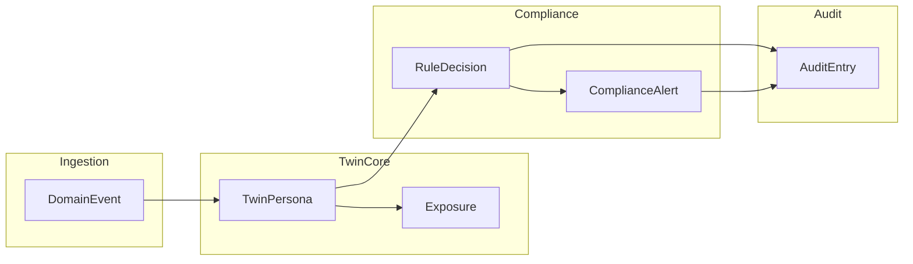
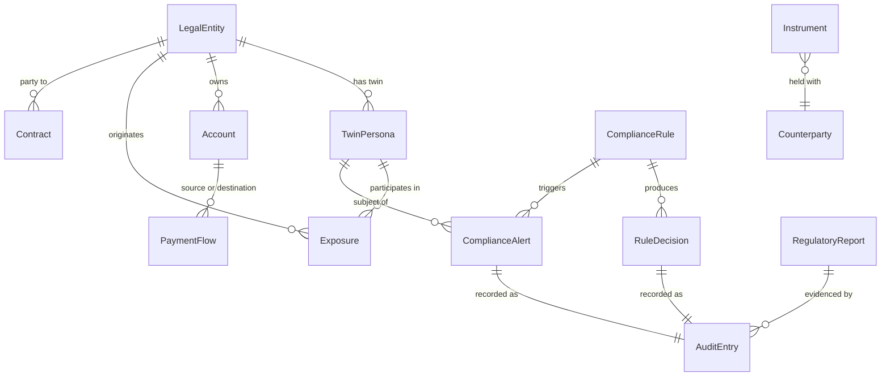

# Domain Model

This document defines the bounded contexts, core entities, digital twin personas, relationships, and ubiquitous language for the Financial Digital Twin + Compliance Platform.

## Purpose

The platform models financial institutions, their operational processes, and interconnections as **living digital twins** — always-on representations that mirror real-world state and behavior. A **compliance overlay** continuously evaluates twin state against codified regulatory obligations and produces auditable evidence.

The twin is an **intelligence layer** over source systems. It does not replace core banking, payment rails, ERP, or contract management systems.

---

## Bounded Contexts

| Context | Responsibility | Owns |
|---------|----------------|------|
| **Twin Core** | Entity state, graph topology, simulation | Personas, exposures, liquidity flows |
| **Ingestion** | Event capture, CDC, schema validation | Connectors, topic contracts |
| **Compliance Monitoring** | Real-time CEP, thresholds, velocity checks | Alerts, breach events |
| **Policy & Rules** | Authorization, obligation evaluation, risk scoring | Cedar policies, decision models |
| **Audit & Evidence** | Immutable decision log, evidence artifacts | Ledger entries, report archives |
| **Regulatory Reporting** | Taxonomy mapping, report generation | XBRL/SDMX outputs, submission metadata |

---

## Core Entities

### LegalEntity

A regulated or reportable organization: bank, fund, SPV, central counterparty, ICT provider, or internal business unit.

| Attribute | Type | Description |
|-----------|------|-------------|
| `entityId` | UUID | Platform identifier |
| `legalName` | string | Registered legal name |
| `lei` | string? | Legal Entity Identifier (ISO 17442) |
| `entityType` | enum | `Bank`, `Fund`, `SPV`, `CCP`, `ICTProvider`, `InternalUnit` |
| `jurisdiction` | ISO 3166-1 | Primary regulatory jurisdiction |
| `consolidationScope` | enum | `Solo`, `Group`, `Excluded` |
| `supervisoryStatus` | enum | `Active`, `UnderReview`, `Restricted` |
| `createdAt` / `updatedAt` | timestamp | Audit timestamps |

### TwinPersona

The digital twin representation of a `LegalEntity` or operational process. Combines structural state with a behavioral layer for simulation.

| Attribute | Type | Description |
|-----------|------|-------------|
| `personaId` | UUID | Twin identifier |
| `sourceEntityId` | UUID | Reference to `LegalEntity` or process |
| `personaType` | enum | `Institution`, `Account`, `Instrument`, `Counterparty`, `Contract`, `PaymentFlow`, `ICTService` |
| `stateVersion` | int | Optimistic concurrency / event sequence |
| `balanceSheet` | object? | Assets, liabilities, capital (institution personas) |
| `behaviorProfile` | object? | Historical response patterns for simulation |
| `lastSyncedAt` | timestamp | Last successful sync from source |
| `complianceStatus` | enum | `Compliant`, `AtRisk`, `Breached`, `Unknown` |

### Account

A ledger account, nostro/vostro account, or regulatory reporting account.

| Attribute | Type | Description |
|-----------|------|-------------|
| `accountId` | UUID | Platform identifier |
| `accountNumber` | string | Source system account number (hashed in audit) |
| `accountType` | enum | `Customer`, `Nostro`, `Vostro`, `Suspense`, `Regulatory` |
| `currency` | ISO 4217 | Account currency |
| `ownerEntityId` | UUID | Owning `LegalEntity` |
| `status` | enum | `Active`, `Frozen`, `Closed` |

### Instrument

A tradable or reportable financial instrument: loan, bond, derivative, equity, deposit.

| Attribute | Type | Description |
|-----------|------|-------------|
| `instrumentId` | UUID | Platform identifier |
| `isin` | string? | International Securities Identification Number |
| `instrumentType` | enum | `Loan`, `Bond`, `Derivative`, `Equity`, `Deposit`, `Repo` |
| `counterpartyId` | UUID? | Primary counterparty |
| `notionalAmount` | decimal | Contract notional |
| `currency` | ISO 4217 | Denomination currency |
| `maturityDate` | date? | Contract maturity |
| `regulatoryClass` | string | Mapping to FINREP/COREP/EMIR taxonomy |

### Counterparty

An external or internal party to a financial relationship.

| Attribute | Type | Description |
|-----------|------|-------------|
| `counterpartyId` | UUID | Platform identifier |
| `entityId` | UUID? | Link to `LegalEntity` if known |
| `riskRating` | enum | `Low`, `Medium`, `High`, `Prohibited` |
| `sanctionsStatus` | enum | `Clear`, `Flagged`, `Blocked` |
| `exposureLimit` | decimal? | Approved exposure limit |

### Contract

A legal agreement governing services, outsourcing, or financial obligations (DORA-relevant ICT contracts, ISDA, SLAs).

| Attribute | Type | Description |
|-----------|------|-------------|
| `contractId` | UUID | Platform identifier |
| `contractType` | enum | `ICTOutsourcing`, `ISDA`, `SLA`, `Treasury`, `Other` |
| `counterpartyId` | UUID | Contracting party |
| `effectiveDate` / `expiryDate` | date | Contract lifecycle |
| `criticalityTier` | enum | `Critical`, `Important`, `Standard` |
| `obligations` | object[] | Structured obligation clauses (SLA, security, exit) |
| `jurisdiction` | ISO 3166-1 | Governing law jurisdiction |

### PaymentFlow

A payment or settlement instruction flowing through RTGS, ACH, SWIFT, or internal rails.

| Attribute | Type | Description |
|-----------|------|-------------|
| `paymentId` | UUID | Platform identifier |
| `sourceAccountId` | UUID | Originating account |
| `destinationAccountId` | UUID | Receiving account |
| `amount` | decimal | Payment amount |
| `currency` | ISO 4217 | Payment currency |
| `settlementSystem` | enum | `RTGS`, `ACH`, `SWIFT`, `Internal` |
| `status` | enum | `Pending`, `Settled`, `Rejected`, `Queued` |
| `valueDate` | date | Settlement value date |
| `initiatedAt` | timestamp | Event timestamp |

### Exposure

A directed financial relationship between two entities or accounts, used for graph analytics and systemic risk.

| Attribute | Type | Description |
|-----------|------|-------------|
| `exposureId` | UUID | Platform identifier |
| `fromEntityId` | UUID | Exposure origin |
| `toEntityId` | UUID | Exposure target |
| `exposureType` | enum | `Interbank`, `Derivative`, `Collateral`, `Funding`, `Securities` |
| `layer` | enum | `ShortTerm`, `LongTerm`, `Contingent` |
| `amount` | decimal | Exposure amount |
| `currency` | ISO 4217 | Denomination |
| `asOfDate` | date | Snapshot date |

### ComplianceRule

A codified regulatory or internal policy rule.

| Attribute | Type | Description |
|-----------|------|-------------|
| `ruleId` | UUID | Platform identifier |
| `ruleCode` | string | Human-readable code (e.g., `DORA-ICT-001`) |
| `regime` | enum | `FINREP`, `COREP`, `AnaCredit`, `EMIR`, `DORA`, `Basel`, `Internal` |
| `engine` | enum | `Cedar`, `DecisionModel`, `FlinkCEP` |
| `version` | semver | Rule version |
| `effectiveFrom` / `effectiveTo` | date | Rule validity window |
| `severity` | enum | `Info`, `Warning`, `Critical`, `Blocking` |

### ComplianceAlert

A real-time breach or threshold violation detected by monitoring.

| Attribute | Type | Description |
|-----------|------|-------------|
| `alertId` | UUID | Platform identifier |
| `ruleId` | UUID | Triggering rule |
| `personaId` | UUID? | Affected twin persona |
| `severity` | enum | `Info`, `Warning`, `Critical`, `Blocking` |
| `status` | enum | `Open`, `Acknowledged`, `Resolved`, `Escalated` |
| `detectedAt` | timestamp | Detection time |
| `evidenceRef` | string | Reference to audit ledger entry |

### RuleDecision

Output of a policy or decision engine evaluation.

| Attribute | Type | Description |
|-----------|------|-------------|
| `decisionId` | UUID | Platform identifier |
| `ruleId` | UUID | Evaluated rule |
| `outcome` | enum | `Allow`, `Deny`, `Flag`, `Escalate` |
| `score` | float? | Risk score (0.0–1.0) |
| `rationale` | string | Human-readable explanation |
| `policyVersion` | semver | Policy version used |
| `evaluatedAt` | timestamp | Evaluation time |
| `inputHash` | string | SHA-256 of evaluation inputs |

### AuditEntry

An immutable record in the tamper-evident audit ledger.

| Attribute | Type | Description |
|-----------|------|-------------|
| `entryId` | UUID | Ledger entry identifier |
| `entryType` | enum | `StateChange`, `RuleDecision`, `Alert`, `ReportGenerated`, `AccessEvent` |
| `subjectId` | UUID | Entity/persona/decision referenced |
| `payloadHash` | string | SHA-256 of payload |
| `previousHash` | string | Hash chain predecessor |
| `recordedAt` | timestamp | Ledger write time |
| `retentionUntil` | date | Regulatory retention expiry |

### RegulatoryReport

A generated regulatory submission artifact.

| Attribute | Type | Description |
|-----------|------|-------------|
| `reportId` | UUID | Platform identifier |
| `regime` | enum | Target regulatory framework |
| `reportType` | string | e.g., `FINREP_F01`, `AnaCredit_Table1` |
| `reportingPeriod` | date range | Covered period |
| `format` | enum | `XBRL`, `SDMX`, `CSV`, `XML` |
| `status` | enum | `Draft`, `Validated`, `Submitted`, `Accepted`, `Rejected` |
| `artifactRef` | string | Object storage reference (immutable) |
| `generatedAt` | timestamp | Generation time |

---

## Graph Relationships

The twin graph models systemic interconnections for contagion analysis, liquidity monitoring, and supervisory intelligence.

### Graph Edge Types

| Edge | From | To | Use Case |
|------|------|-----|----------|
| `OWNS` | LegalEntity | Account | Balance sheet aggregation |
| `EXPOSED_TO` | LegalEntity | LegalEntity | Interbank / counterparty risk |
| `COLLATERALIZED_BY` | Instrument | Instrument | Collateral chains |
| `FUNDS` | LegalEntity | LegalEntity | Funding dependencies |
| `SETTLES_VIA` | PaymentFlow | Account | Settlement bottleneck detection |
| `OUTSOURCES_TO` | LegalEntity | LegalEntity | DORA ICT dependency mapping |
| `GOVERNED_BY` | Contract | LegalEntity | Contract obligation tracking |

---

## Twin Persona Types

| Persona Type | Source | State Maintained | Simulation Use |
|--------------|--------|------------------|----------------|
| **Institution** | Core banking, regulatory filings | Balance sheet, capital ratios, liquidity buffers | Stress testing, capital impact |
| **Account** | Ledger systems | Balances, transaction velocity | AML velocity, limit monitoring |
| **Instrument** | Trading / loan systems | Notional, maturity, classification | Portfolio risk, FINREP mapping |
| **Counterparty** | CRM / KYC systems | Risk rating, sanctions status | Counterparty limit enforcement |
| **Contract** | Contract management (Ariba, CLM) | Obligations, SLA terms, criticality | DORA ICT compliance, exit planning |
| **PaymentFlow** | RTGS / payment rails | Settlement status, queue depth | Intraday liquidity, bottleneck alerts |
| **ICTService** | Vendor registry | Availability, security SLA, location | DORA resilience monitoring |

---

## Ubiquitous Language (Glossary)

| Term | Definition |
|------|------------|
| **Digital Twin** | A living, always-on virtual representation of a financial entity or process that ingests real-time data and supports simulation. |
| **Twin Persona** | The platform's concrete twin instance for a specific entity or process type. |
| **Compliance Overlay** | The embedded layer that continuously evaluates twin state against rules, records decisions, and generates reports. |
| **Intelligence Layer** | Architectural pattern where the twin sits above source systems, adding analytics without replacing operational systems. |
| **Exposure Layer** | A graph layer (short-term, long-term, contingent) representing a class of financial relationships for systemic analysis. |
| **Policy-as-Code** | Regulatory and internal rules expressed in version-controlled, testable formats (Cedar, decision models). |
| **CEP** | Complex Event Processing — pattern detection across event streams (e.g., velocity fraud, settlement queues). |
| **Obligation** | A structured contractual or regulatory requirement derived from legal text (e.g., SLA uptime, exit clause). |
| **Evidence Artifact** | An immutable file (report, snapshot, decision log export) stored with retention locks for audit. |
| **Regime** | A regulatory framework (FINREP, COREP, AnaCredit, EMIR, DORA, Basel) with its own taxonomy and reporting schedule. |
| **Consolidation Scope** | Whether an entity is reported solo, within a group, or excluded from consolidation (FINREP/COREP). |
| **Systemic Importance** | A measure of an institution's network centrality and contagion potential in the exposure graph. |
| **Behavioral Layer** | Simulation component modeling how management might respond under stress (liquidity hoarding, asset sales). |
| **Tamper-Evident Ledger** | Append-only, cryptographically verifiable audit store (immudb) replacing deprecated QLDB. |
| **Explainable Risk Score** | A traceable, mathematically grounded risk assessment suitable for regulator review. |

---

## Aggregate Roots and Consistency Boundaries

| Aggregate | Root Entity | Invariants |
|-----------|-------------|------------|
| **InstitutionTwin** | TwinPersona (Institution) | Balance sheet must reconcile with source; `stateVersion` monotonic |
| **PaymentSession** | PaymentFlow | Settlement status transitions are linear; no duplicate settlement |
| **ComplianceEvaluation** | RuleDecision | Every evaluation produces exactly one audit entry |
| **RegulatorySubmission** | RegulatoryReport | Report cannot transition to `Submitted` without validation pass |

---

## Identity and External References

| External ID | Standard | Used By |
|-------------|----------|---------|
| LEI | ISO 17442 | LegalEntity, AnaCredit, EMIR |
| ISIN | ISO 6166 | Instrument |
| BIC | ISO 9362 | PaymentFlow, counterparty identification |
| EBA taxonomy codes | EBA ITS | FINREP/COREP reporting |
| LEI of ICT provider | ISO 17442 | DORA register |

All external identifiers are stored as normalized strings with validation at ingestion. Internal UUIDs are used for all platform references to avoid coupling to source system IDs.

---

## Event-Sourced State Transitions

Twin persona state is derived from an append-only event stream. Key domain events:

| Event | Trigger | State Effect |
|-------|---------|--------------|
| `EntityStateUpdated` | CDC / connector sync | Updates persona fields, increments `stateVersion` |
| `ExposureRecorded` | Graph ingestion | Creates/updates graph edge |
| `PaymentInitiated` | Payment rail event | Creates PaymentFlow persona |
| `PaymentSettled` | Settlement confirmation | Updates PaymentFlow status |
| `RuleEvaluated` | Policy engine | Creates RuleDecision + AuditEntry |
| `ComplianceBreached` | Monitoring / rules | Creates ComplianceAlert, sets persona `complianceStatus` |
| `ReportGenerated` | Reporting service | Creates RegulatoryReport + AuditEntry |

---

## Open Design Questions

1. **Multi-tenant vs single-institution**: Does one deployment serve one regulated entity or a supervisory authority monitoring many?
2. **Consolidation hierarchy depth**: How many levels of group consolidation must the graph support?
3. **Behavioral layer scope**: Full agent-based simulation at v1, or deterministic stress scenarios only?
4. **Contract NLP pipeline**: Is unstructured legal text parsed at ingestion, or are obligations pre-structured in source systems?

These are tracked in [roadmap.md](./roadmap.md) under Open Decisions.
