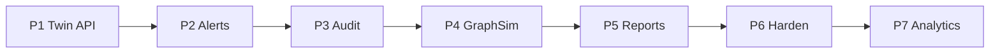

# Phase journeys

Canonical public map of **journey name + Phase N** for the Digital Twin Compliance Platform. Prefer these names in README, demos, and UI chrome — never Phase alone as the headline.

**CECT** (mentioned in changelog/ADRs) is the corporate delivery program that landed Phases 5–7 on this site. It is not a user-facing product tier.

**CI vs local:** Phases 1–4 smokes run in GitHub Actions CI. Phases 5–7 smokes and `./scripts/harness/verify.sh` are local/harness gates until CI wiring lands.

| Phase | Journey name | What you prove | UI(s) | Smoke | Demo |
|-------|--------------|----------------|-------|-------|------|
| 1 | Ingestion & twin | CDC → persona API | (API `:8080`) | `./scripts/smoke-test.sh` | — |
| 2 | Monitoring & alerts | CEP → open alert | [Alert Console](http://localhost:3000) `:3000` | `./scripts/smoke-test-phase2.sh` | — |
| 3 | Policy & audit | Cedar/Zen + immudb proof | [Audit Explorer](http://localhost:3002) `:3002` | `./scripts/smoke-test-phase3.sh` | [demo-phase3.md](demo-phase3.md) |
| 4 | Graph & simulation | Exposure + stress | [Graph Explorer](http://localhost:3003) `:3003`, [Simulation Console](http://localhost:3004) `:3004` | `./scripts/smoke-test-phase4.sh` | [demo-phase4.md](demo-phase4.md) |
| 5 | Regulatory reporting | Draft → submit + Object Lock | [Report Console](http://localhost:3005) `:3005` | `./scripts/smoke-test-phase5.sh` | [demo-phase5.md](demo-phase5.md) |
| 6 | Hardening | OIDC / TLS / OTel | via edge `:8180` / `:8443` | `./scripts/smoke-test-phase6-*.sh` | [deployment.md](deployment.md) |
| 7 | Cutting-edge analytics | Effectiveness / contagion / reg→policy / graph | APIs (no dedicated UI) | `./scripts/smoke-test-phase7-*.sh` | [ADR-013](adr/013-phase7-cutting-edge-foundation.md) |

## Consoles

All five Next.js consoles share product chrome and an app switcher (`packages/console-shell`). Open any console, then jump across journeys without memorizing ports.

| Console | Port | Journey |
|---------|------|---------|
| Alert Console | 3000 | Monitoring & alerts · Phase 2 |
| Audit Explorer | 3002 | Policy & audit · Phase 3 |
| Graph Explorer | 3003 | Graph & simulation · Phase 4 |
| Simulation Console | 3004 | Graph & simulation · Phase 4 |
| Report Console | 3005 | Regulatory reporting · Phase 5 |

## Related

- Public status: [ROADMAP.md](../ROADMAP.md)
- Architecture status table: [architecture.md](architecture.md)
- Engineering detail: [roadmap.md](roadmap.md) (status of record for shipped capability is still [ROADMAP.md](../ROADMAP.md))
