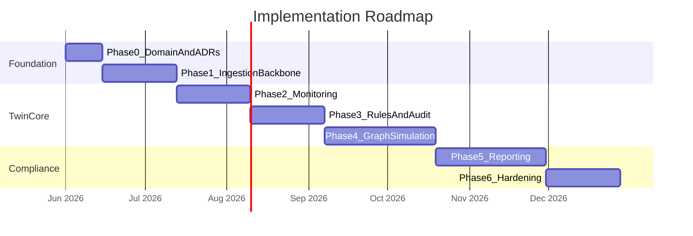

# Roadmap

Phased implementation plan, risks, and open decisions for the Financial Digital Twin + Compliance Platform.

See also: [architecture.md](./architecture.md), [compliance-mapping.md](./compliance-mapping.md), [adr/](./adr/).

---

## Implementation Phases

---

## Phase 0: Domain Model and Architecture

**Duration**: 2 weeks  
**Status**: Complete

### Deliverables

- [x] [domain-model.md](./domain-model.md) — Entities, personas, glossary
- [x] [architecture.md](./architecture.md) — C4 diagrams, tech assignments
- [x] [adr/](./adr/) — Six architecture decision records
- [x] [compliance-mapping.md](./compliance-mapping.md) — Regime → rule → check → report
- [x] [data-flow.md](./data-flow.md) — Topics, schemas, flows
- [x] [roadmap.md](./roadmap.md) — This document

### Exit Criteria

- Architecture reviewed and approved by stakeholders
- Open decisions resolved (see Section 4)
- Target regimes confirmed
- Team structure agreed

---

## Phase 1: Ingestion Backbone and Minimal Twin

**Duration**: 4 weeks  
**Dependencies**: Phase 0 complete  
**Status**: Complete

**Implementation handoff**: [phase1-implementation-spec.md](./phase1-implementation-spec.md) · [handoff-parallel-agent.md](./handoff-parallel-agent.md) · [AGENTS.md](../AGENTS.md) · [ADR-007](./adr/007-phase1-foundation-decisions.md)

### Scope

- Kafka cluster (KRaft) + Schema Registry
- Debezium CDC from one source system (PostgreSQL core banking mock)
- Go ingestion connector framework
- State Service (Go) — upsert TwinPersona, Account, Instrument
- PostgreSQL entity store with outbox pattern
- Basic REST API for persona queries
- CI pipeline with schema compatibility checks

### Deliverables

| Component | Technology | Acceptance Criteria |
|-----------|------------|---------------------|
| Kafka cluster | KRaft, 3 brokers | Producing/consuming with Avro schemas |
| Debezium connector | PostgreSQL CDC | Changes appear on `domain.events` within 5s |
| State Service | Go + PostgreSQL | Persona CRUD via REST; outbox → Kafka |
| Schema repository | Avro in Git | CI validates compatibility |
| Seed data | SQL scripts | 10 institutions, 100 accounts, 500 instruments |

### Risks

| Risk | Likelihood | Impact | Mitigation |
|------|------------|--------|------------|
| Source system schema unknown | Medium | High | Start with mock PostgreSQL; real connector in Phase 2 |
| Kafka ops complexity | Medium | Medium | Use managed Kafka (Confluent Cloud) for dev/staging |

### Exit Criteria

- Events flow from source DB → Kafka → State Service → PostgreSQL
- Persona query API returns seeded data
- Schema CI gate passing

---

## Phase 2: Real-Time Monitoring

**Duration**: 4 weeks  
**Dependencies**: Phase 1 complete  
**Status**: Spec ready — implementation not started

**Implementation handoff**: [phase2-implementation-spec.md](./phase2-implementation-spec.md) · [handoff-phase2-agent.md](./handoff-phase2-agent.md) · [ADR-008](./adr/008-phase2-foundation-decisions.md)

### Scope

- Apache Flink deployment (Kubernetes Operator)
- 3 initial CEP patterns: velocity (INT-M001), exposure limit (INT-M002), LCR threshold (BASEL-M001)
- Redis online feature store
- Alert publishing to `compliance.alerts` topic
- WebSocket hub for real-time alert streaming
- Basic alert console in Next.js UI

### Deliverables

| Component | Technology | Acceptance Criteria |
|-----------|------------|---------------------|
| Flink CEP job | Java | 3 patterns detecting breaches from seed data |
| Redis feature store | Redis 7 | Rolling counters updated by Flink |
| Alert Service | Go | Alerts persisted + streamed via WebSocket |
| Alert Console UI | Next.js | Live alert feed with acknowledge action |
| Monitoring dashboard | Grafana | Kafka lag, Flink checkpoint metrics |

### Risks

| Risk | Likelihood | Impact | Mitigation |
|------|------------|--------|------------|
| Flink checkpoint failures | Medium | High | Start simple; monitor from day one; savepoint recovery tested |
| CEP pattern false positives | High | Medium | Tune thresholds with compliance officers; start with Warning severity |

### Exit Criteria

- Simulated breach events produce alerts within 2s p99
- Alerts visible in UI within 5s of detection
- Flink checkpoint success rate > 99%

---

## Phase 3: Rules Engine and Audit Ledger

**Duration**: 4 weeks  
**Dependencies**: Phase 2 complete

### Scope

- Cedar Policy Service (Go + Cedar SDK)
- Decision Service (Go + GoRules Zen)
- 5 Cedar policies (access control) + 5 Zen decision models (Internal + COREP rules)
- Audit Service (Go + immudb)
- All compliance events written to immudb with hash chain
- Rule evaluation CI pipeline (Cedar Analyzer + Zen fixtures)
- Audit Explorer UI (basic search + verification)

### Deliverables

| Component | Technology | Acceptance Criteria |
|-----------|------------|---------------------|
| Cedar Service | Go + Cedar SDK | 5 policies enforcing access/obligation checks |
| Decision Service | Go + Zen | 5 decision models with CI test fixtures |
| Audit Service | Go + immudb | All Phase 2 alerts + Phase 3 decisions in ledger |
| immudb | Self-hosted K8s | Hash chain verification passing |
| Audit Explorer UI | Next.js | Search by rule, date, entity; integrity badges |
| CI policy gates | GitHub Actions | Cedar Analyzer + Zen tests block merge on failure |

### Risks

| Risk | Likelihood | Impact | Mitigation |
|------|------------|--------|------------|
| immudb write throughput | Low | High | Benchmark early; buffer to Kafka on failure |
| Zen maturity concerns | Medium | Medium | Drools fallback spike (1 week) if Zen insufficient |
| Cedar learning curve | Medium | Low | Start with 5 simple policies; training session |

### Exit Criteria

- Rule evaluation produces RuleDecision + AuditEntry for every trigger
- Audit chain verification passes on 100% of entries
- CI blocks deployment of failing policies

---

## Phase 4: Graph Model and Simulation

**Duration**: 6 weeks  
**Dependencies**: Phase 3 complete

### Scope

- Graph Service (Go + Neo4j)
- Exposure ingestion from domain events
- Graph visualization UI (sigma.js / react-flow)
- Simulation Service (Python)
- Deterministic stress test scenario (ECB Adverse)
- Agent-based contagion model (optional, if time permits)
- Explainable risk scores linked to audit ledger

### Deliverables

| Component | Technology | Acceptance Criteria |
|-----------|------------|---------------------|
| Graph Service | Go + Neo4j | Exposure graph from seed data; Cypher API |
| Graph UI | Next.js + sigma.js | Interactive exposure graph with layer filtering |
| Simulation Service | Python + NetworkX | One stress scenario producing explainable results |
| Simulation UI | Next.js | Scenario parameter form + results comparison |
| Basel rules on simulation | Zen decision models | COREP-R001/R002 evaluated against simulation output |

### Risks

| Risk | Likelihood | Impact | Mitigation |
|------|------------|--------|------------|
| Neo4j scaling | Low | Medium | Start with Community Edition; Aura if needed |
| Simulation accuracy | Medium | High | Validate against known stress test results; document assumptions |
| Python-Go integration | Low | Low | gRPC with Protobuf contracts |

### Exit Criteria

- Exposure graph visualized with 10+ institutions and 50+ edges
- Stress scenario completes in < 60s for seed dataset
- Simulation results linked to audit ledger with explainability reference

---

## Phase 5: Regulatory Reporting

**Duration**: 6 weeks  
**Dependencies**: Phase 4 complete

### Scope

- Reporting Service (Python)
- Taxonomy mapping layer (PostgreSQL)
- FINREP F01 (Balance Sheet) report generation in XBRL
- AnaCredit Table 2 (Instrument data) in SDMX
- DORA ICT Register in XML
- Report validation against taxonomy schemas
- S3 Object Lock artifact storage
- Report review and submission tracking UI
- ClickHouse for report aggregation metrics

### Deliverables

| Component | Technology | Acceptance Criteria |
|-----------|------------|---------------------|
| Reporting Service | Python | 3 report types generated from twin state |
| Taxonomy mapper | PostgreSQL | Instrument → EBA code mapping with versioning |
| XBRL generator | Python (arelle validation) | FINREP F01 passes EBA taxonomy validation |
| SDMX generator | Python | AnaCredit Table 2 valid against ECB schema |
| S3 Object Lock | S3-compatible | Reports stored with 7-year retention |
| Report UI | Next.js | Draft review, validation errors, submission tracking |
| ClickHouse | ClickHouse | Pre-aggregated metrics for report inputs |

### Risks

| Risk | Likelihood | Impact | Mitigation |
|------|------------|--------|------------|
| Taxonomy complexity | High | High | Start with one FINREP template; expand incrementally |
| XBRL library maturity | Medium | Medium | Use arelle for validation; test against published examples |
| Mapping errors | High | High | Compliance officer review gate before submission |

### Exit Criteria

- FINREP F01 generated from seed data and passes taxonomy validation
- Report artifacts stored in S3 Object Lock with audit ledger reference
- Report UI shows draft → validated → submitted lifecycle

---

## Phase 6: Hardening and Production Readiness

**Duration**: 4 weeks  
**Dependencies**: Phase 5 complete

### Scope

- Kubernetes production deployment (Terraform IaC)
- immudb HA cluster
- OpenTelemetry tracing across all services
- Security audit (Cedar policies, secrets, encryption)
- Load testing (10K events/sec target)
- Disaster recovery procedures
- Runbooks and operational documentation
- Explainability documentation for regulators

### Deliverables

| Component | Technology | Acceptance Criteria |
|-----------|------------|---------------------|
| Terraform modules | Terraform | dev/staging/prod environments |
| immudb HA | K8s cluster | 3-node cluster with backup/recovery tested |
| Observability | OTel + Prometheus + Grafana | End-to-end traces; alerting on SLO breaches |
| Security review | Manual + Cedar Analyzer | No critical findings; all secrets in Vault |
| Load test | k6 or custom | 10K events/sec sustained for 30 min |
| DR runbook | Markdown | Recovery from Kafka/Flink/immudb failure tested |
| Explainability doc | Markdown | Regulator-facing documentation of risk scores |

### Risks

| Risk | Likelihood | Impact | Mitigation |
|------|------------|--------|------------|
| Production ops complexity | High | High | Managed services where possible; runbooks tested |
| Security findings | Medium | High | Security review in Phase 3; address incrementally |

### Exit Criteria

- All services deployed to staging with HA
- Load test passes 10K events/sec target
- DR recovery tested for each critical component
- Security review complete with no critical findings

---

## Risk Register (Cross-Phase)

| ID | Risk | Phase | Likelihood | Impact | Mitigation | Owner |
|----|------|-------|------------|--------|------------|-------|
| R1 | Source system integration delays | 1–2 | High | High | Mock data first; adapter pattern | Platform |
| R2 | Flink operational complexity | 2 | Medium | High | Managed Flink option; start simple | Streaming |
| R3 | immudb performance at scale | 3 | Low | High | Benchmark early; Kafka buffer fallback | Platform |
| R4 | Regulatory taxonomy changes | 5 | High | Medium | Versioned mapping layer; annual review process | Compliance |
| R5 | Polyglot team skill gaps | All | Medium | Medium | Go as primary; training for Java/Python | Engineering |
| R6 | False positive alert fatigue | 2–3 | High | Medium | Tune thresholds with compliance officers | Compliance |
| R7 | Zen engine maturity | 3 | Medium | Medium | Drools fallback documented and tested | Platform |
| R8 | GDPR vs immutable audit conflict | 3 | Medium | High | immudb TTL expiration; legal review | Legal/Compliance |
| R9 | Cross-regime rule duplication | 3–5 | Medium | Low | Shared rule references; dedup in mapping layer | Compliance |
| R10 | Scope creep (too many regimes at once) | All | High | High | Phase 5 limits to 3 report types; expand later | Product |

---

## Open Decisions

These must be resolved before or during Phase 0 exit:

| ID | Decision | Options | Recommendation | Status |
|----|----------|---------|----------------|--------|
| D1 | **Deployment model** | Single institution vs supervisory multi-tenant | Start single-institution; design for multi-tenant later | Decided (ADR-007) |
| D2 | **Target regimes (Phase 5)** | All 6 vs subset | FINREP + AnaCredit + DORA for Phase 5; expand in Phase 6+ | Open |
| D3 | **Decision engine** | GoRules Zen vs Drools | Zen (see ADR-005); Drools fallback if needed | Decided |
| D4 | **Managed vs self-hosted Kafka** | Confluent Cloud vs self-hosted KRaft | Local KRaft for dev/CI; managed for staging+ (ADR-007) | Decided (ADR-007) |
| D5 | **Simulation scope (Phase 4)** | Deterministic only vs agent-based | Deterministic stress test in Phase 4; agent-based in Phase 6+ | Open |
| D6 | **Contract NLP pipeline** | Parse unstructured legal text vs pre-structured obligations | Pre-structured for Phase 1–4; NLP in Phase 6+ if needed | Open |
| D7 | **Graph DB** | Neo4j vs Memgraph | Neo4j (mature GDS library); evaluate Memgraph if latency insufficient | Decided |
| D8 | **Jurisdiction / data residency** | EU-only vs multi-region | Design for EU self-hosted; immudb on EU infrastructure | Open |
| D9 | **Consolidation hierarchy depth** | 2 levels vs unlimited | 3 levels (parent → subsidiary → sub-subsidiary) for Phase 1–5 | Decided (ADR-007) |
| D10 | **Identity provider** | Keycloak vs Auth0 vs cloud IdP | Keycloak (self-hosted, OIDC, no vendor lock-in) | Recommended |

---

## Team Structure

| Role | Phase 0 | Phase 1–2 | Phase 3–4 | Phase 5–6 |
|------|---------|-----------|-----------|-----------|
| Platform Engineer (Go) | 1 | 2 | 2 | 2 |
| Streaming Engineer (Java/Flink) | — | 1 | 1 | 1 |
| Analytics Engineer (Python) | — | — | 1 | 1 |
| Frontend Engineer (TypeScript) | — | 1 | 1 | 1 |
| Compliance Engineer | 1 | 0.5 | 1 | 1 |
| DevOps / SRE | — | 0.5 | 0.5 | 1 |

**Total peak**: ~7 FTE during Phase 5–6

---

## Success Metrics

| Metric | Phase 2 | Phase 3 | Phase 5 | Phase 6 |
|--------|---------|---------|---------|---------|
| Event ingestion latency | < 5s | < 2s | < 2s | < 1s |
| Monitoring alert latency | < 2s p99 | < 2s p99 | < 2s p99 | < 1s p99 |
| Rule evaluation latency | — | < 5ms p99 | < 5ms p99 | < 5ms p99 |
| Audit write durability | — | 100% | 100% | 100% |
| Report generation time | — | — | < 30 min | < 15 min |
| System availability | — | — | 99.5% | 99.9% |
| Event throughput | 1K/sec | 5K/sec | 5K/sec | 10K/sec |

---

## Dependencies and Prerequisites

| Prerequisite | Required By | Notes |
|--------------|-------------|-------|
| Kubernetes cluster | Phase 1 | dev/staging minimum |
| Source system access (or mock) | Phase 1 | PostgreSQL mock acceptable |
| Compliance officer availability | Phase 2–3 | Rule threshold tuning |
| EBA taxonomy files | Phase 5 | Download from EBA website |
| ECBC SDMX schemas | Phase 5 | For AnaCredit |
| Legal review (GDPR + immudb) | Phase 3 | Before production audit data |

---

## Document Index

| Document | Path | Status |
|----------|------|--------|
| Domain Model | [domain-model.md](./domain-model.md) | Complete |
| Architecture | [architecture.md](./architecture.md) | Complete |
| Compliance Mapping | [compliance-mapping.md](./compliance-mapping.md) | Complete |
| Data Flow | [data-flow.md](./data-flow.md) | Complete |
| Roadmap | [roadmap.md](./roadmap.md) | Complete |
| ADR-001: Kafka + Flink | [adr/001-kafka-flink-streaming.md](./adr/001-kafka-flink-streaming.md) | Accepted |
| ADR-002: Cedar + Zen | [adr/002-cedar-decision-engine.md](./adr/002-cedar-decision-engine.md) | Accepted |
| ADR-003: immudb | [adr/003-immudb-audit-ledger.md](./adr/003-immudb-audit-ledger.md) | Accepted |
| ADR-004: Datastores | [adr/004-datastore-selection.md](./adr/004-datastore-selection.md) | Accepted |
| ADR-005: Zen vs Drools | [adr/005-gorules-zen-vs-drools.md](./adr/005-gorules-zen-vs-drools.md) | Accepted |
| ADR-006: Polyglot | [adr/006-polyglot-language-strategy.md](./adr/006-polyglot-language-strategy.md) | Accepted |
